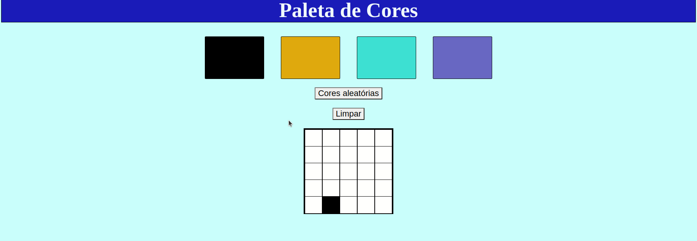

# Project Pixels Art <h1>

### Um dos projetos mais desafiadores que desenvolvi na trybe, a aplicação simula um quadro onde você pode selecionar entre quatro cores e pintar o quadro, você támbem pode limpar o quadro e pintar com novas cores.

## Ferramentas utilizadas no desenvolvimento ⚒️:
+ HTML
+ CSS 
+ JAVASCRIPT

## Arquivos que eu desenvolvi:
+ index.html
+ style.css
+ script.js

## Os outros arquivos foram desenvolvidos pela Trybe.

 
<br<>

### One of the most challenging projects I've developed at trybe, the application simulates a board where you can select between four colors and paint the board, you can also clean the board and paint with new colors.

## Tools used in development ⚒️:
+ HTML
+ css
+ JAVASCRIPT

## Files I developed:
+ index.html
+ style.css
+ script.js

## The other files were developed by Trybe.